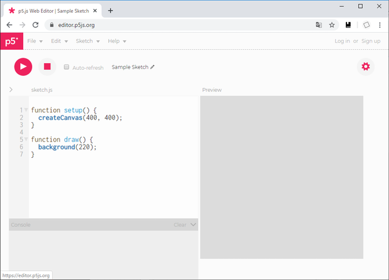
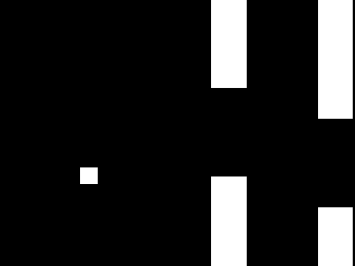
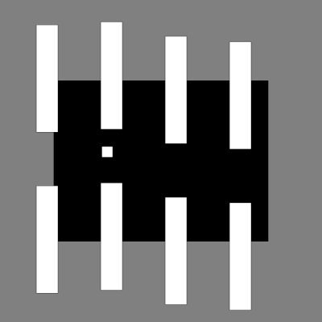

【編集メモ】
- まず Flappy Bird を作る
- 余裕があれば転用してブロック崩しを作る（当日、時間次第で削ってOK）
- あとでコードの差分を手動で強調する？

---

# **p5.js でゲーム制作**

# 講師自己紹介

...

# はじめに

## プログラミングによる作品制作の醍醐味

- 「自分の世界」を創造できる
- その世界がどんな部品や構造で成り立つのかを掌握できる  
（「作り方」を知ってるぜ、と言える）
- 他色々

## なぜ「ゲーム」か

- 誰でも自分で操作して、その世界の中で文字通り「遊ぶ」ことができる
- プログラムの「部品」や「構造」が比較的重要、かつ多くのゲームに共通
- ゲームに限らず、動きのある作品やインタラクティブな作品に応用できる

## このワークショップの狙い

- プログラムを少しずつ組み立てて、ミニゲームを作り上げる過程を体験する
- 自分でも何か作れそうだな、という感触を得る


# 準備

このワークショップでは [p5.js Web Editor](https://editor.p5js.org/) を使います



ユーザーアカウントを持っていない人は、右上の "Sign Up" から登録  
（スケッチの保存・共有機能を使っていただきたいため）

※ 使い慣れたエディタがあればそれを使って編集し、保存だけ Web Editor で行う、という使い方でも可

<details>
<summary>補足（上級）： 環境関連の諸々</summary><div class="appendix">

不特定多数の人にスケッチを見てもらいたい人は、[NEORT](https://neort.io/) や [OpenProcessing](https://www.openprocessing.org/) などで公開するのも良いでしょう。

ローカルで使うための強力なエディタとしては、例えば [Visual Studio Code](https://azure.microsoft.com/ja-jp/products/visual-studio-code/) などがあります。  
参考： [PCD2019の田所先生のワークショップ資料](https://yoppa.org/pcd19)

他にもいろいろ便利なツールがあります。例えば……
- [ESLint](https://eslint.org/) は、推奨される書き方から外れたコードについて警告したり自動で修正したりしてくれます。  
- [Prettier](https://prettier.io/) は、スペースや改行や括弧の有無などを一定の規則で自動整形してくれます。
- ツールと呼ぶのも微妙ですが [TypeScript](https://www.typescriptlang.org/) は、JavaScript に静的型付けを導入した言語です。
- モジュールバンドラ（[webpack](https://webpack.js.org/) 他色々）は、複数のファイルに分けて書いたソースコードを統合してくれます。
- パッケージ管理ツール（[npm](https://www.npmjs.com/) や [Yarn](https://yarnpkg.com/lang/ja/)）は、以上のような各種ツールのダウンロードや実行を補佐してくれます。

なにいってだこいつ、と思った人は正常です。これがジャバスクリプトだ！  
気楽に書けるのがメリットであるはずの p5.js で、がっちり環境を整える人はあまり多くはないでしょうから、慣れてきてから調べるのでも遅くないと思います。

</div></details>

# p5.js スケッチの基本構造

## スケッチの準備

```javascript
function setup() {
  createCanvas(800, 600); // 800 x 600 ピクセル。今回このサイズでやっていきます
}

function draw() {
  background(0); // 黒背景。後で自由に変えていただきます
}
```

- 最初に1回だけ `setup()` が実行される
- `draw()` が繰り返し実行されることで、動いているように見える
  - この1回1回を「フレーム」と呼ぶ
  - デフォルトでは毎秒60回実行される。  
これを「フレームレートは 60 FPS」などと言う（FPS = frames per second）

## リンク

### p5.js の基本について再確認したいとき
[p5.js チートシート](https://bmoren.github.io/p5js-cheat-sheet/ja.html)  
※ ここに書いていないものだと、システム変数 `frameCount` も使う（`draw()` が呼ばれるたびに1ずつ増える値）

### 公式のリファレンス

[https://p5js.org/reference/](https://p5js.org/reference/)


# Flappy Bird ライクなゲームを作る

## Flappy Bird とは

[Flappy Bird Gameplay - IGN - YouTube](https://www.youtube.com/watch?v=fQoJZuBwrkU)


- 土管にぶつからないように鳥を操作する、非常にシンプルなモバイルゲーム
- 開発者： Dong Nguyen
- 2014年頃に爆発的に流行（現在は削除済み）
- いろいろなゲームの中でも特に作りやすく、かつ基礎を学ぶにも適している

## 今回作るゲームの仕様

Flappy Bird を抽象化した、次のようなミニゲームを作る  
（この例では見た目に全く気を使っていませんが、各自アレンジしていただきます）



ルール：
- マウスボタンを押すとジャンプ
- 画面下端まで落ちるか、障害物にぶつかるとゲームオーバー
- （本当は点数もカウントして表示したいけど、一旦省略）

# コードを書く前に、少し考えてみる

## 画面上に存在する物体に名前を与える

今回、次のように呼ぶことにする

- 「プレイヤー」： 遊ぶ人が操作する対象
- 「ブロック」： 迫ってくる障害物
- 「エンティティ」： 「プレイヤー」と「ブロック」の総称

以上が今回の主役となる

<details>
<summary>補足（上級）： 名前の重要性</summary>

<div class="appendix">

名前は極めて重要である、という話はしばしば聞かれます。  
例えば：
[名前重要 | プログラマが知るべき97のこと](https://xn--97-273ae6a4irb6e2hsoiozc2g4b8082p.com/%E3%82%A8%E3%83%83%E3%82%BB%E3%82%A4/%E5%90%8D%E5%89%8D%E9%87%8D%E8%A6%81/)

</div></details>

<details>
<summary>補足（上級）： この命名で良いのか</summary><div class="appendix">

正直なんとも言えません。

例えば、初期案の見た目から「ブロック」と名付けちゃったけど、もしグラフィックを差し替えてブロック状に見えなくなったら、それはもうブロックじゃないんじゃないか？ など色々考えられます。

事前に予想できる範囲で極力適切な名前をつけるとしても、作りたいものの最終形が変化したら個々の名前も変化するのは仕方ない、と考えて都度修正していくことも必要かもしれません。

</div></details>

<details>
<summary>補足（上級）： 「エンティティ」という用語について</summary><div class="appendix">

分野によってはよく使われますが、一般には馴染みが無いと思います。  
直訳すると「実体」。

もう少しググると「独立した一意の対象物」みたいな定義が出てきます。  
これは何かというと、まずエンティティではない例として、たとえば次のようなコードがあり、値は絶対に変化しないものとする。

```javascript
const sizeA = { width: 100, height: 100 };
const sizeB = { width: 100, height: 100 };
```

このとき、`sizeA` も `sizeB` も指し示すものは全く同じである（区別する必要が無い）という可能性が高そうです。

逆に次のようなものを考える。

```javascript
const personA = { name: "山田太郎", birthYear: 1984 };
const personB = { name: "山田太郎", birthYear: 1984 }; // 別人
```

これを見ると、中身が同じでも実体としては別物と考える必要がありそうです。  
こういう、一つ一つを区別するべき対象のことをエンティティと呼ぶのだ、と考えて概ね間違いはないと思う。

ただ、以上はとりわけ一般的かつ大雑把な説明です。  
ゲームでエンティティと言う場合は、物理的な存在（つまり概念的なものではなく、必ずゲーム世界の空間のどこかに位置しているような何か）だけを指すかもしれないし、あるいはそれに限らないかもしれません。

細かいことは文脈次第であり、ひとまず本ワークショップでは、ゲーム空間内を移動できるような物体、つまり少なくとも「位置」と「速度」を持つような物体のことを「エンティティ」と呼んでいます。

「エンティティ」（entity）以外の用語候補としては、「ゲームオブジェクト」（game object）や「アクター」（actor）などがありえます。

</div></details>


## エンティティに関連する「データ」と「処理」を考える

簡単のため、ブロックの大きさは一定（画面からはみ出しているだけ）と考える



### 個別のエンティティごとに必要なデータ

- 位置 (x, y)
- 速度 (x, y)

※ 四角形の色や大きさなどは、プレイヤー・ブロックのそれぞれで共通  
　 → 一つ一つのエンティティごとに異なっている必要はない、と考える

### エンティティ（のデータ）に関連する処理

- 全エンティティ共通
  - 位置の更新（速度を適用する）
- プレイヤー用
  - 作成
  - 重力の適用
  - ジャンプ
  - 描画
- ブロック用
  - 作成
  - 描画


# まずはプレイヤーだけ実装してみる

## やること

1. プレイヤーを入れる変数を用意する
1. `setup()` の中で、プレイヤーを作成する
1. `draw()` の中で、プレイヤーについて以下を行う
    - 位置の更新
    - 重力の適用
    - 描画
1. マウスボタンを押したときだけ、プレイヤーをジャンプさせる

## 必要な関数が揃っている、と仮定して書いてみる

```javascript
// ---- エンティティ関連の関数 --------------------------------------------------

// （あとで）

// ---- ゲーム全体に関わる変数 --------------------------------------------------

/** プレイヤーエンティティ */
let player;

// ---- setup/draw 他 ----------------------------------------------------------

function setup() {
  createCanvas(800, 600);
  rectMode(CENTER);

  player = createPlayer();
}

function draw() {
  // プレイヤーの位置を更新
  updatePosition(player);

  // プレイヤーに重力を適用
  applyGravity(player);

  // プレイヤーを描画
  background(0);
  drawPlayer(player);
}

function mousePressed() {
  // プレイヤーをジャンプさせる
  applyJump(player);
}
```

## 必要な関数を用意する

```javascript
// ---- エンティティ関連の関数 --------------------------------------------------

// 全エンティティ共通

function updatePosition(entity) {
  entity.x += entity.vx;
  entity.y += entity.vy;
}

// プレイヤーエンティティ

function createPlayer() {
  return {
    x: 200,
    y: 300,
    vx: 0,
    vy: 0
  };
}

function applyGravity(entity) {
  entity.vy += 0.15;
}

function applyJump(entity) {
  entity.vy = -5;
}

function drawPlayer(entity) {
  square(entity.x, entity.y, 40);
}
```


# ブロックを1個だけ実装してみる

## やること

1. ブロックを入れる変数を用意する
1. `setup()` の中で、ブロックを作成する
1. `draw()` の中で、ブロックについて以下を行う
    - 位置の更新
    - 描画

## 必要な関数が揃っている、と仮定して書いてみる

```javascript
// ---- エンティティ関連の関数 --------------------------------------------------

// （省略）

// ---- ゲーム全体に関わる変数 --------------------------------------------------

/** プレイヤーエンティティ */
let player;

/** ブロックエンティティ */
let block;

// ---- setup/draw 他 ----------------------------------------------------------

function setup() {
  createCanvas(800, 600);
  rectMode(CENTER);

  player = createPlayer();
  block = createBlock(300); // 指定したy座標で作成。とりあえず画面中央の高さで
}

function draw() {
  // 全エンティティの位置を更新
  updatePosition(player);
  updatePosition(block);

  // プレイヤーに重力を適用
  applyGravity(player);

  // 全エンティティを描画
  background(0);
  drawPlayer(player);
  drawBlock(block);
}

function mousePressed() {
  // プレイヤーをジャンプさせる
  applyJump(player);
}
```

## 必要な関数を用意する

```javascript
// ---- エンティティ関連の関数 --------------------------------------------------

// 全エンティティ共通

function updatePosition(entity) {
  entity.x += entity.vx;
  entity.y += entity.vy;
}

// プレイヤーエンティティ用

function createPlayer() {
  return {
    x: 200,
    y: 300,
    vx: 0,
    vy: 0
  };
}

function applyGravity(entity) {
  entity.vy += 0.15;
}

function applyJump(entity) {
  entity.vy = -5;
}

function drawPlayer(entity) {
  square(entity.x, entity.y, 40);
}

// ブロックエンティティ用

function createBlock(y) {
  return {
    x: 900,
    y,
    vx: -2,
    vy: 0
  };
}

function drawBlock(entity) {
  rect(entity.x, entity.y, 80, 400);
}
```

# ビジュアルをアレンジしてみる

# ブロックを複数にする

# ゲームオーバーを実装する

# 衝突判定を実装する

# さらにアレンジしてみる
